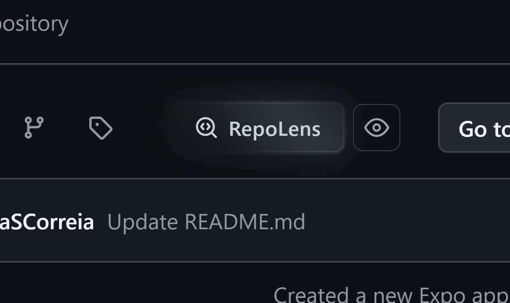
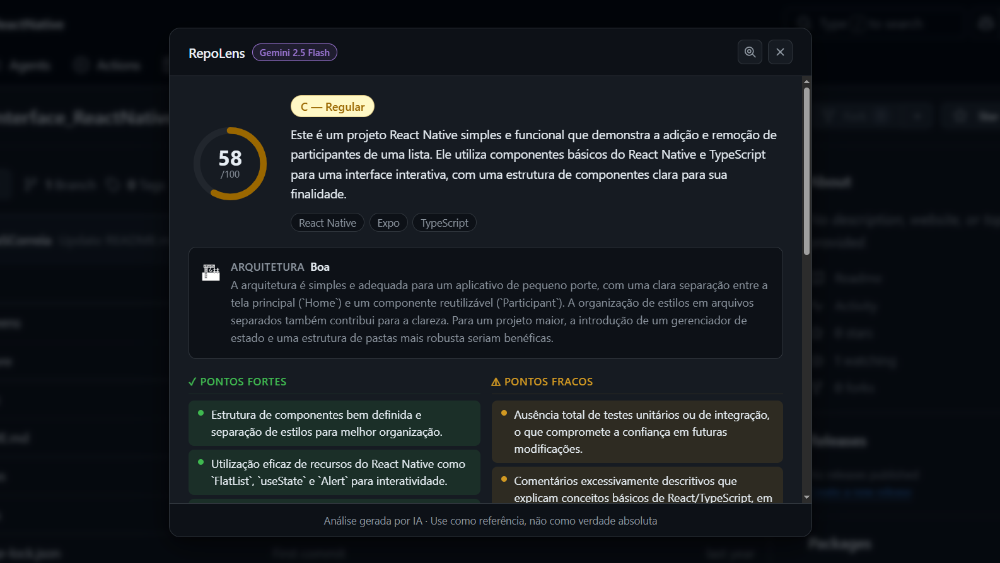
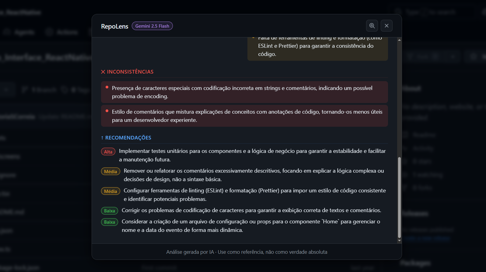
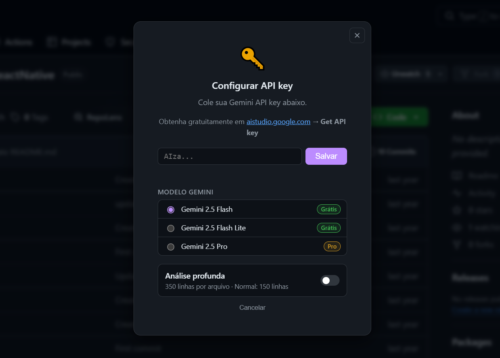

# RepoLogs

**AI-powered code quality analysis for GitHub repositories — right in your browser.**

RepoLogs is a Chrome extension that injects an analysis button into any public GitHub repository page. One click triggers an intelligent file sampling pipeline, sends the code to Google Gemini, and renders a detailed quality report — score, grade, architecture rating, security flags, strengths, weaknesses, and actionable recommendations — without leaving GitHub.

---

## Features

- **One-click analysis** — button injected directly into GitHub's repo header
- **AI scoring** — 0–100 score with letter grade (A–F) powered by Google Gemini
- **Comprehensive report** — summary, strengths, weaknesses, inconsistencies, recommendations (high / medium / low priority), detected tech stack, and security flags
- **Architecture evaluation** — dedicated rating with qualitative notes
- **Intelligent file sampling** — priority files (README, package.json, Dockerfile, CI configs) + centrality-based code file selection; ignores `node_modules`, `dist`, tests, lock files, and binaries
  - **Dependency graph** — all sampled files are scanned for `import`/`require` statements to build a directed dependency graph; each edge represents one file importing another. Files are then ranked by **in-degree** (number of other files that import them), so the most architecturally central modules rise to the top of the selection pool. Priority files always occupy the first slots regardless of in-degree.
- **Deep mode** — increases per-file line budget from 150 → 350 lines for larger codebases
- **Multiple Gemini models** — Gemini 2.5 Flash (default), 2.5 Flash Lite, or 2.5 Pro
- **Free tier** — one free analysis using the system key; unlimited with your own Gemini API key
- **Result caching** — analyses are cached by commit SHA for instant re-viewing
- **Dark / light theme** — follows the OS preference

---

## Screenshots






---

## How It Works

```
User clicks "RepoLogs" on GitHub
        │
        ▼
Content Script → Background Worker
        │
        ├─ 1. Fetch repo metadata (default branch, latest SHA)
        ├─ 2. Fetch full file tree via GitHub API
        ├─ 3. Sample up to 80 files (priority + code files)
        ├─ 4. Read file contents — 8 concurrent requests, max 150/350 lines each
        ├─ 5. Build dependency graph → rank files by import centrality
        ├─ 6. Select top 40 files within token budget
        ├─ 7. Call Gemini API with structured prompt
        └─ 8. Cache result and send to content script
                │
                ▼
        Modal rendered with full report
```

---

## Tech Stack

| Layer | Technology |
|---|---|
| Language | TypeScript |
| Build tool | Vite 8 |
| UI | Preact 10 |
| Extension bundler | @crxjs/vite-plugin |
| AI provider | Google Gemini (generativelanguage.googleapis.com) |
| Data source | GitHub REST API v3 |
| Runtime | Chrome Extension Manifest V3 (service worker + content script) |

---

## Installation (Development)

### Prerequisites

- **Node.js** ≥ 18
- **npm** ≥ 9
- A [Google AI Studio](https://aistudio.google.com) account to generate a Gemini API key

### Steps

```bash
# 1. Clone the repository
git clone https://github.com/your-org/RepoLogs_GithubExtension.git
cd RepoLogs_GithubExtension

# 2. Install dependencies
npm install

# 3. Configure environment variables
cp .env.example .env
# Edit .env and set VITE_GEMINI_SYSTEM_KEY to your Gemini API key (optional — enables free tier)

# 4. Build for production
npm run build

# 5. Load the extension in Chrome
#    a. Open chrome://extensions/
#    b. Enable "Developer mode" (top-right toggle)
#    c. Click "Load unpacked"
#    d. Select the dist/ folder
```

### Development (hot reload)

```bash
npm run dev
# Vite dev server starts; reload the extension in chrome://extensions/ after the first build
```

---

## Available Scripts

| Command | Description |
|---|---|
| `npm run dev` | Start Vite dev server with hot reload |
| `npm run build` | Production build → `dist/` |
| `npm run preview` | Preview the production build locally |

---

## Environment Variables

Create a `.env` file at the project root (see `.env.example`):

| Variable | Required | Description |
|---|---|---|
| `VITE_GEMINI_SYSTEM_KEY` | Optional | Gemini API key used for the free-tier analysis. Without it the free tier is disabled. |

---

## Extension Settings

All settings are persisted in Chrome's local storage.

| Setting | Default | Description |
|---|---|---|
| `userApiKey` | `null` | Personal Gemini API key — enables unlimited analyses and model selection |
| `geminiModel` | `gemini-2.5-flash` | Active Gemini model (`gemini-2.5-flash`, `gemini-2.5-flash-lite`, `gemini-2.5-pro`) |
| `deepMode` | `false` | Read up to 350 lines per file instead of 150 |
| `systemKeyUsed` | `false` | Tracks whether the single free-tier analysis has been used |
| `analysisCount` | `0` | Cumulative number of analyses performed |
| `cache` | `{}` | Analysis results keyed by repo SHA (max 50 entries) |

Settings are accessible via the extension popup (click the toolbar icon).

---

## Project Structure

```
src/
├── manifest.ts              # Chrome extension manifest (Manifest V3)
├── background/
│   └── worker.ts            # Service worker — analysis orchestration
├── content/
│   ├── index.ts             # Content script entry point
│   ├── button.ts            # Injects "RepoLogs" button into GitHub pages
│   └── modal.ts             # Result modal UI (score ring, report sections)
├── popup/
│   ├── index.ts             # Popup controller
│   ├── index.html           # Popup markup
│   └── popup.css            # Popup styles
└── shared/
    ├── types.ts             # Shared TypeScript interfaces
    ├── api-key-manager.ts   # System key vs. user key resolution
    ├── gemini.ts            # Gemini API client
    ├── github.ts            # GitHub API client (tree, file content)
    ├── sampler.ts           # Intelligent file sampling and centrality ranking
    ├── prompt.ts            # Gemini system + user prompts
    └── storage.ts           # Chrome storage wrapper + cache management
```

---

## Analysis Report Structure

The Gemini response is parsed into the following structure:

```typescript
interface AnalysisResult {
  score: number;           // 0–100
  grade: string;           // A | B | C | D | F
  summary: string;
  strengths: string[];
  weaknesses: string[];
  inconsistencies: string[];
  recommendations: Recommendation[];  // { text, priority: 'high'|'medium'|'low' }
  architecture: { rating: string; notes: string };
  techStack: string[];
  securityFlags: string[];
}
```

---

## Chrome Permissions

| Permission | Reason |
|---|---|
| `storage` | Persist settings and cached analyses |
| `activeTab` | Read current tab URL to extract owner/repo |
| `https://api.github.com/*` | Fetch repository metadata and file contents |
| `https://generativelanguage.googleapis.com/*` | Call the Gemini API |

---

## Contributing

1. Fork the repository and create a feature branch
2. Run `npm run dev` and load the `dist/` folder as an unpacked extension
3. Make your changes — the service worker auto-reloads; content scripts require a manual extension reload in `chrome://extensions/`
4. Open a pull request with a clear description of the change

---

## License

MIT — see [LICENSE](LICENSE) for details.

---

> _Analysis is generated by AI. Use as a reference, not as an absolute truth._
